# Weather-API 

## created by codeXdeveloper

## Description

### Weather-API is Client-side JavaScript web API and online weather data handling system. It is developed mostly by combining `HTML` and `CSS` for rendering with support of `JavaScript` and functional capabilities.

## Usage

### New repository created at GitHub account strahinjapopovic as weather-api.

[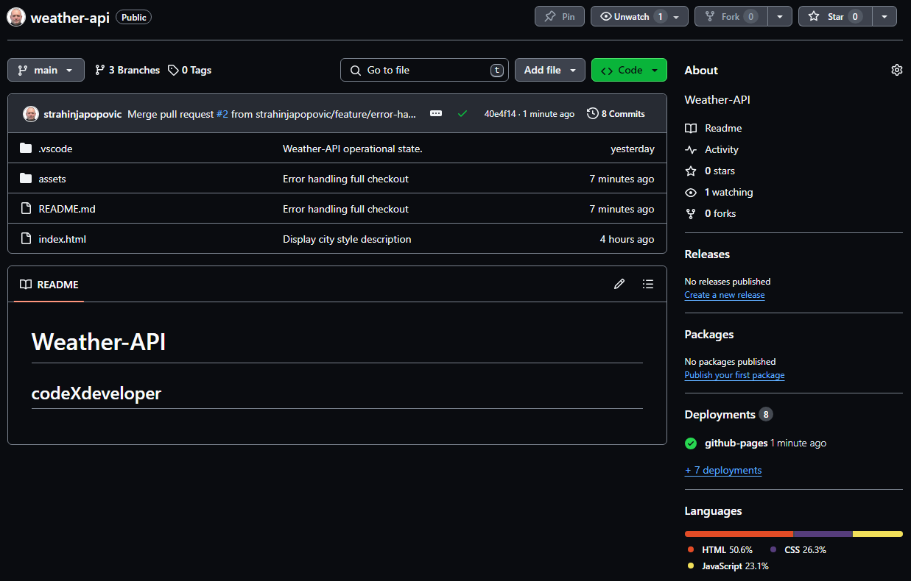](./screenshots/github-weather-api-repo.PNG)

### Project has been pushed from the local storage to GitHub repo as *(main)*.
### *Continuing with Git Bash setting up dir tree and codebase...*

[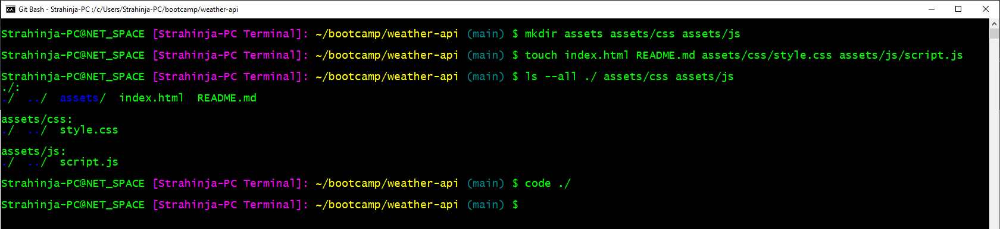](./screenshots/gitbash-weather-api-dir-tree.PNG)

### Repo weather-api was pushed remotely as **(main)** with Git Bash to GitHub existing repo.

[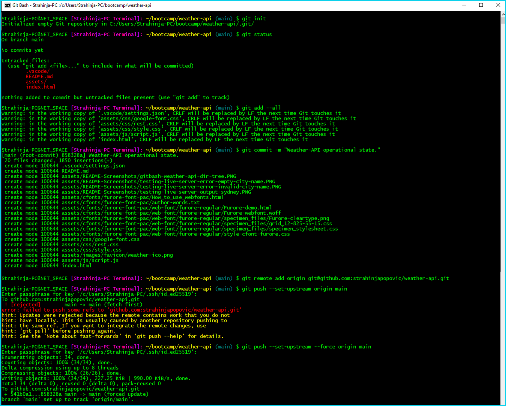](./screenshots/gitbash-remote-origin.png)

### *Continuing with expanded functionality and minor changes in URL fetch request setting up HTTPS protocol instead HTTP...*

[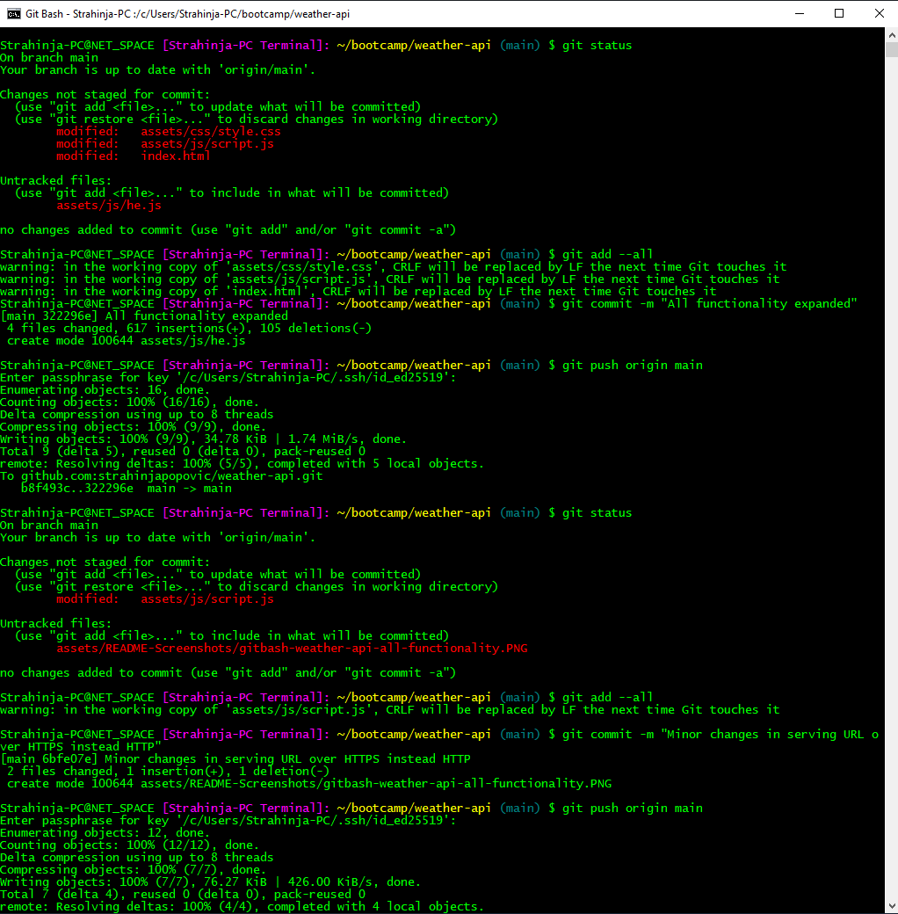](./screenshots/gitbash-weather-api-all-functionality.PNG)

### Style changes of cities weather description improved through branch ***(feature/display-cities-style)***, feature branch as follows.

[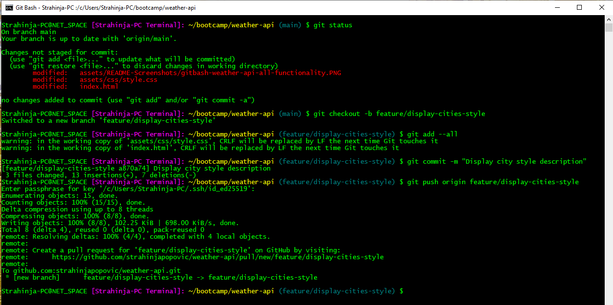](./screenshots/gitbash-weather-api-feature-branch-cities.PNG)

### *Continuing (1) at GitHub repo...*

[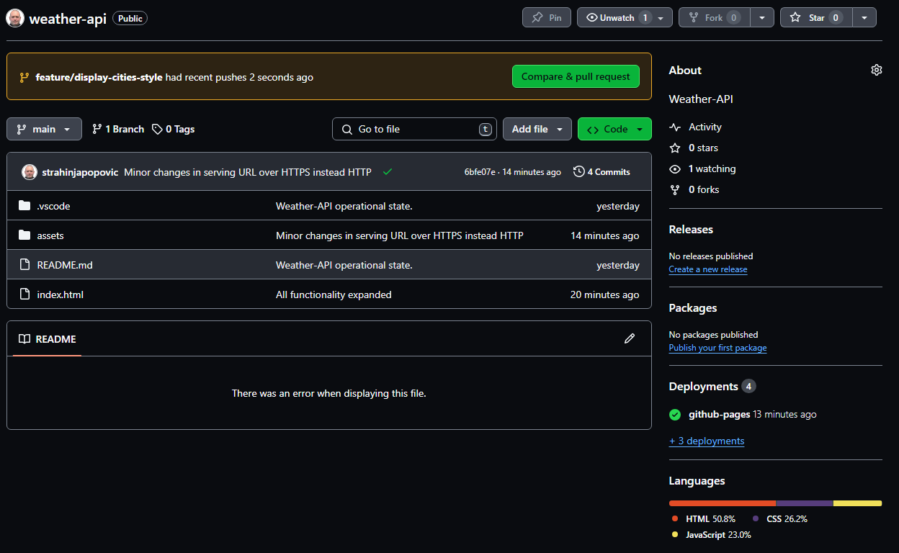](./screenshots/github-feature-branch-cities-style-1.PNG)

### *Continuing (2)...*

[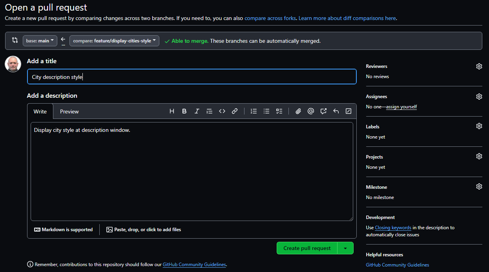](./screenshots/github-feature-branch-cities-style-2.PNG)

### *Continuing (3)...*

[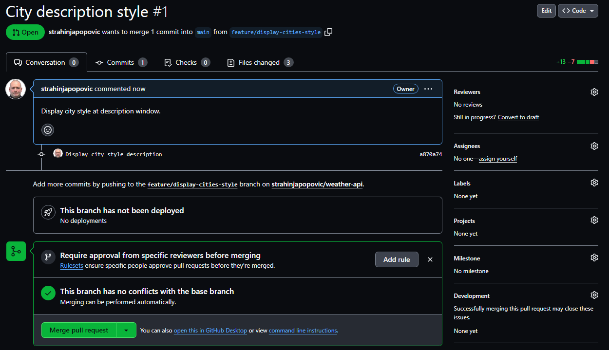](./screenshots/github-feature-branch-cities-style-3.PNG)

### Marge the ***(main)*** branch with ***(feature/display-cities-style)*** feature branch as follows.

[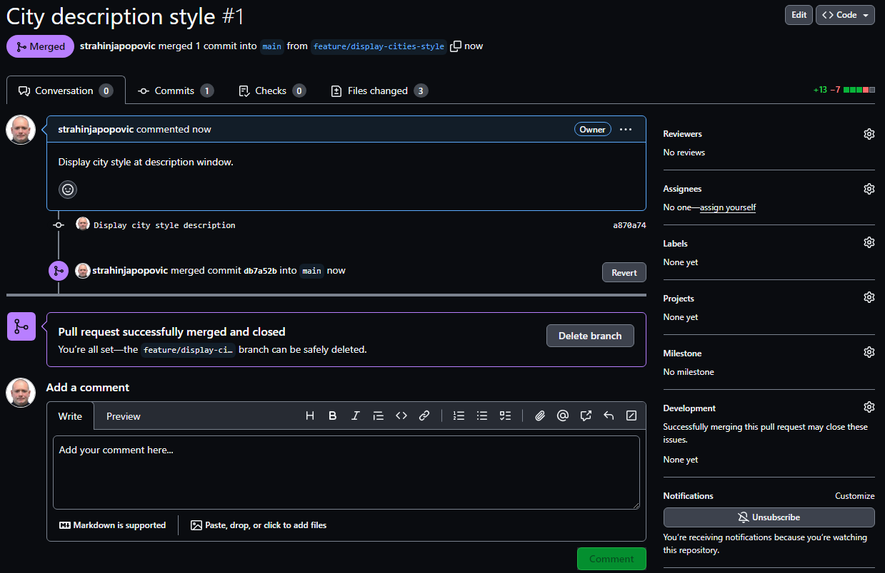](./screenshots/github-feature-branch-cities-style-pull-req-finished.PNG)

### New **branch** was created as **(feature/error-handling)** with Git Bash.

[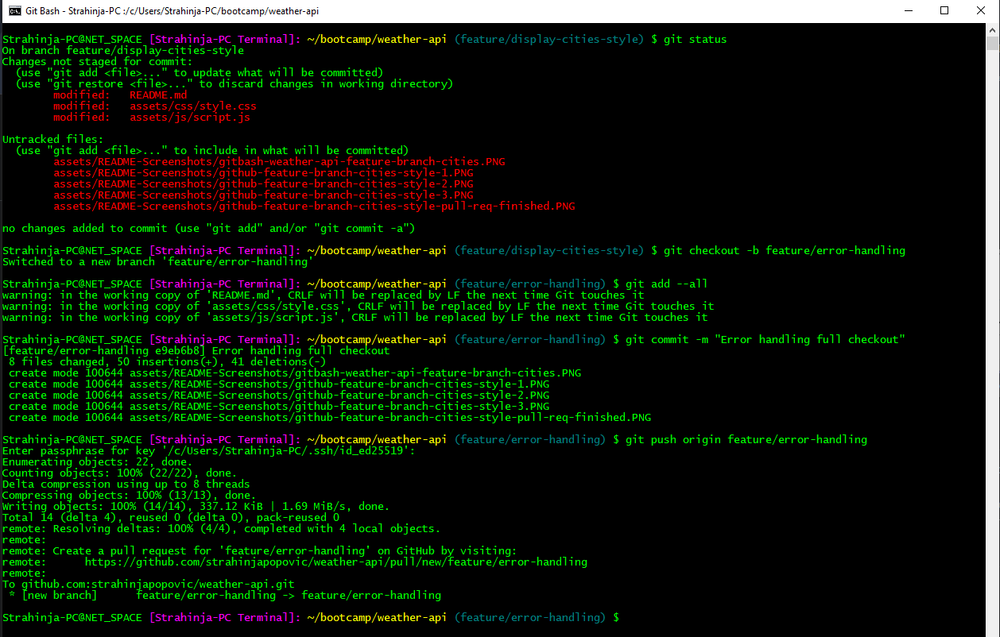](./screenshots/gitbash-weather-api-error-handling.PNG)

### *Continuing (1) at GitHub repo...*

[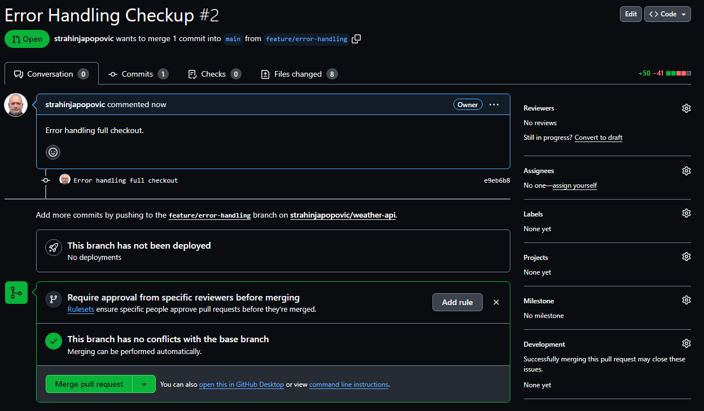](./screenshots/github-feature-branch-error-handling-1.PNG)

### Marge the ***(main)*** branch with ***(feature/error-handling)*** feature branch as follows.

### *All Branches*

[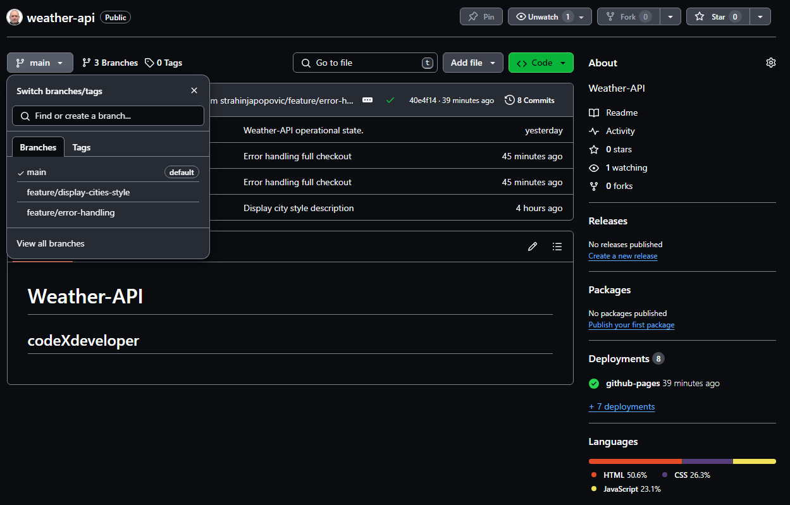](./screenshots/all-branches.PNG)

### *Application has been deployed at GitHub Pages with a following results:*

### *Begining state where error handler indicating that city history is empty.*

[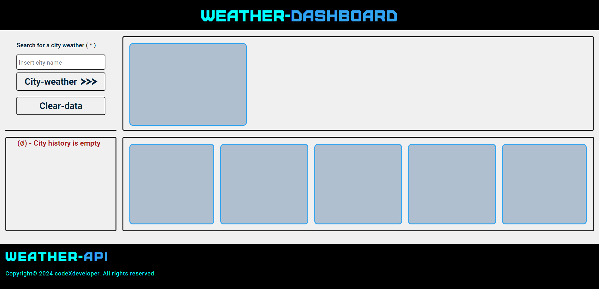](./screenshots/online-test-1-state-0.PNG)

### *The second error handler indicating that city input is empty.*

[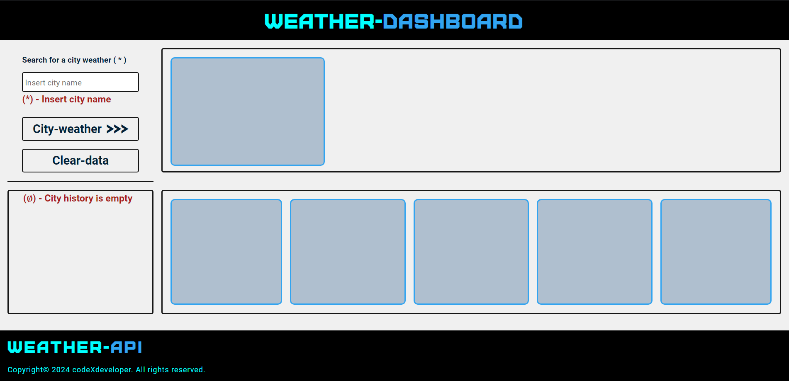](./screenshots/online-test-error-hendler-1.PNG)

### *First city inserted as "Sydney"*

[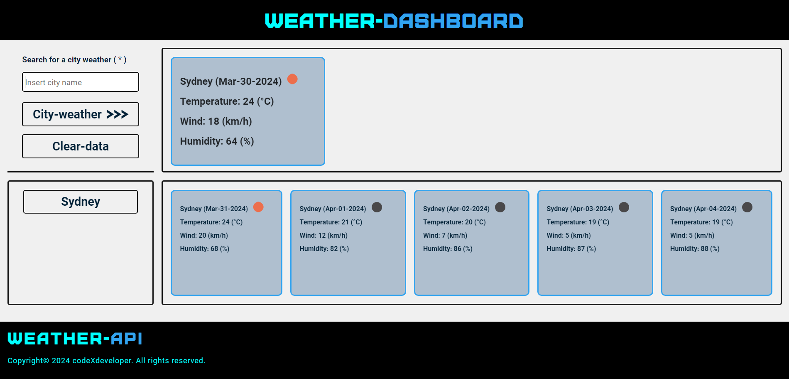](./screenshots/online-test-1-state-city-sydney.PNG)

### *The second city inserted as "Melbourne"*

[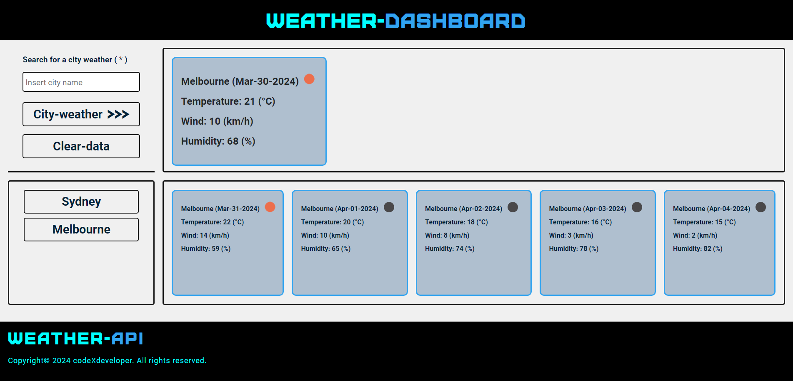](./screenshots/online-test-1-state-city-melbourne.PNG)

### *The third city inserted as "Brisbane"*

### *If inserted more then 3 cities at once error message appears as follows...*

[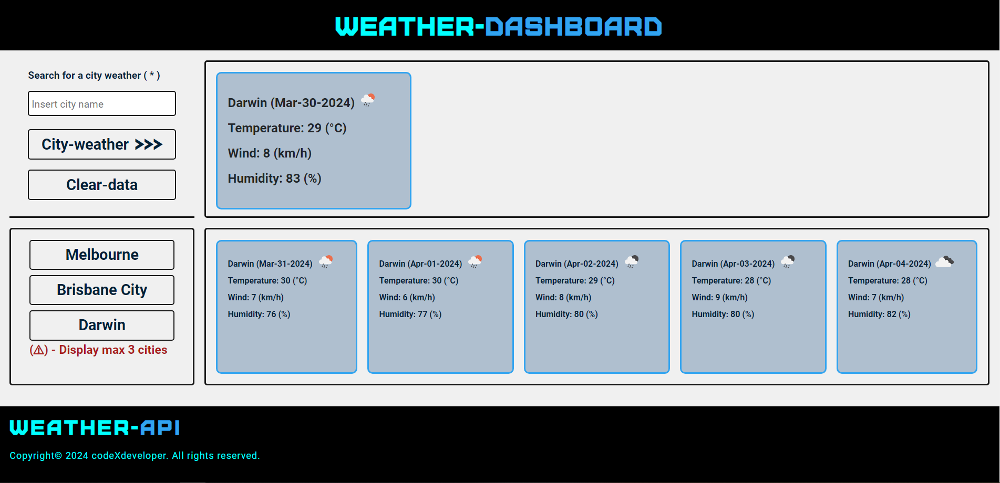](./screenshots/online-test-1-state-city-darwin.PNG)

### *If inserted a name of the city that do not exists error message appears as follows...*

[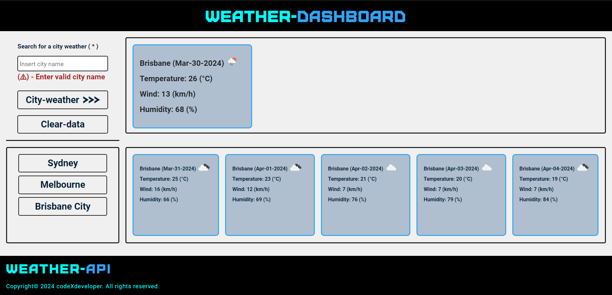](./screenshots/online-test-error-hendler-2.PNG)

### *By clicking on any button application should display weather details accordingly to the city that button belongs to.*

Repository over GitHub account you can find [GitHub Repos][1] and application deployment at [GitHub Pages][2].

[1]: https://github.com/strahinjapopovic/weather-api        "GitHub Repos"
[2]: https://strahinjapopovic.github.io/weather-api/        "GitHub Pages"

## License

Please refer to the MIT LICENSE in the repo.
